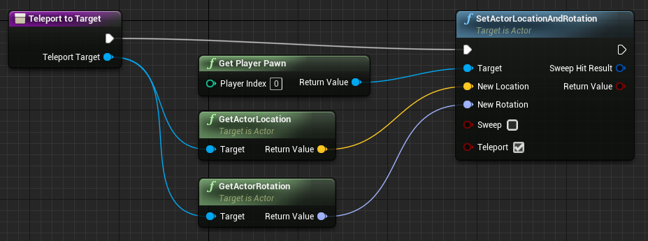

# ue4-misc

## C++ classes

### LogFileWriter and MarkerHandler

LogFileWriter an actor class that continuously writes time, position and orientation of the first player, as well as user-defined markers to a tab-separated text file.

MarkerHandler is an actor class that plays together with LogFileWriter for storing markers/triggers for events in the logfile. Furthermore, it interfaces the [InpOutx64 DLL/driver](http://www.highrez.co.uk/downloads/inpout32/) for sending markers over the parallel port (for communication with hardware that still uses the parallel port.)

See subfolders for different engine versions.

## Blueprints

### TeleportToTarget

Teleport the pawn of the first player to the location of a given target (e.g. [Target Point](https://docs.unrealengine.com/latest/INT/Engine/Actors/TargetPoint/) actor). See also the Blueprint function [Teleport](https://api.unrealengine.com/INT/BlueprintAPI/Utilities/Transformation/Teleport/)

### FadeOut

Fade the view of the first player to black.

### FadeIn

Fade the view of the first player back from black.

